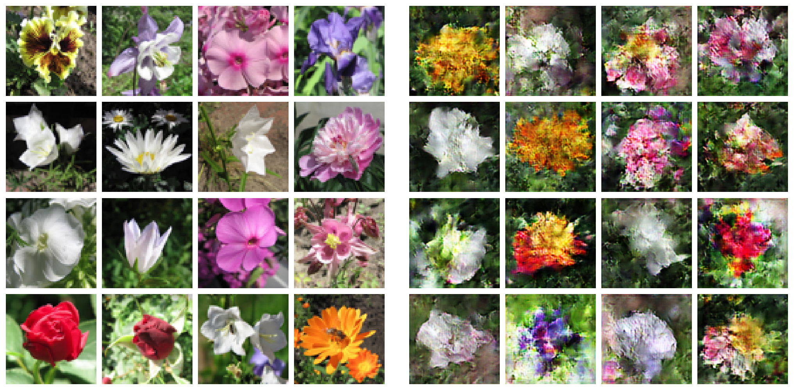

# Image generator using a DCGAN

Implementation of a DCGAN (Deep Convolutional Generative Adversarial Network) for image generation based on [this article](https://towardsdatascience.com/gan-by-example-using-keras-on-tensorflow-backend-1a6d515a60d0).

A set of pictures of flowers are used as a sample dataset. The original dataset can be found [here](https://www.kaggle.com/olgabelitskaya/flower-color-images?select=flower_images). Unzip before running the code with `python main_gan_flower.py`.

Sample of true pictures of flowers used for training (left) and random generated images after 15000 steps (right).